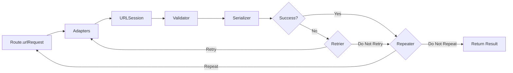

# PopNetworking [](https://github.com/djk12587/PopNetworking/actions/workflows/Run-Tests.yml)

A protocol-oriented networking layer for Swift. Define endpoints as types, execute them with async/await, and compose adapters, retriers, and interceptors to handle cross-cutting concerns like authentication. Built with Swift 6 strict concurrency.

## Table of Contents

- [Requirements](#requirements)
- [Installation](#installation)
- [Documentation](#documentation)
- [Architecture](#architecture)
- [Quick Start](#quick-start)
- [Core Concepts](#core-concepts)
  - [Response Serializers](#response-serializers)
  - [Response Validation](#response-validation)
  - [NetworkingSession](#networkingsession)
  - [Adapters](#adapters)
  - [Retriers](#retriers)
  - [Interceptors](#interceptors)
  - [Priority](#priority)
  - [Repeater](#repeater)
  - [Testing](#testing)
- [License](#license)

## Requirements

- Swift 6.0+
- Xcode 16+
- iOS 13+ / tvOS 13+ / watchOS 6+ / macOS 10.15+ / visionOS 1.0+ / Mac Catalyst 13+

## Installation

Add PopNetworking to your project via Swift Package Manager:

```swift
dependencies: [
    .package(url: "https://github.com/djk12587/PopNetworking.git", from: "4.0.0")
]
```

## Documentation

- [Full API Reference](https://djk12587.github.io/PopNetworking/documentation/popnetworking)

## Architecture

### Request Lifecycle



## Quick Start

### Define a Route

```swift
enum UserAPI {
    struct GetUser: NetworkingRoute {
        let userId: Int

        var baseUrl: String { "https://api.example.com" }
        var path: String { "users/\(userId)" }
        var method: NetworkingRouteHttpMethod { .get }
        var responseSerializer: NetworkingResponseSerializers.DecodableResponseSerializer<User> {
            .init()
        }
    }

    struct CreateUser: NetworkingRoute {
        let name: String
        let email: String

        var baseUrl: String { "https://api.example.com" }
        var path: String { "users" }
        var method: NetworkingRouteHttpMethod { .post }
        var parameterEncoding: NetworkingRouteParameterEncoding? {
            .json(params: ["name": name, "email": email])
        }
        var responseSerializer: NetworkingResponseSerializers.DecodableResponseSerializer<User> {
            .init()
        }
    }
}
```

### Execute

```swift
// async/await
let user = try await UserAPI.GetUser(userId: 42).run

// Result
let result = await UserAPI.GetUser(userId: 42).result

// Completion handler
UserAPI.GetUser(userId: 42).request { result in
    switch result {
    case .success(let user): print(user)
    case .failure(let error): print(error)
    }
}

// Combine
UserAPI.GetUser(userId: 42).publisher
    .sink { result in print(result) }

UserAPI.GetUser(userId: 42).failablePublisher
    .sink(receiveCompletion: { _ in },
          receiveValue: { user in print(user) })
```

### Quick Route (No Custom Type)

For one-off requests, use the built-in `Route` struct:

```swift
let data = try await Route(
    baseUrl: "https://api.example.com",
    path: "health",
    responseSerializer: NetworkingResponseSerializers.DataResponseSerializer()
).run
```

## Core Concepts

### Response Serializers

Serializers parse raw response data into typed objects. PopNetworking includes four built-in serializers:

| Serializer | Output | Use Case |
|---|---|---|
| `DecodableResponseSerializer<T>` | `T: Decodable` | Parse JSON into a model |
| `DecodableResponseAndErrorSerializer<T, E>` | `T: Decodable` | Parse JSON into a model or a typed API error |
| `DataResponseSerializer` | `Data` | Raw response data |
| `HttpStatusCodeResponseSerializer` | `Int` | HTTP status code only |

Implement `NetworkingResponseSerializer` to create your own:

```swift
struct StringResponseSerializer: NetworkingResponseSerializer {
    func serialize(responseResult: Result<(Data, URLResponse), Error>) async -> Result<String, Error> {
        responseResult.flatMap { data, _ in
            guard let string = String(data: data, encoding: .utf8) else {
                return .failure(URLError(.cannotDecodeContentData))
            }
            return .success(string)
        }
    }
}
```

### Response Validation

Validate raw responses before serialization. Throw to indicate failure:

```swift
struct StatusCodeValidator: NetworkingResponseValidator {
    func validate(responseResult: Result<(Data, URLResponse), Error>) throws {
        let (_, response) = try responseResult.get()
        guard let http = response as? HTTPURLResponse,
              (200..<300).contains(http.statusCode) else {
            throw URLError(.badServerResponse)
        }
    }
}

struct GetUser: NetworkingRoute {
    // ...
    var responseValidator: NetworkingResponseValidator? { StatusCodeValidator() }
}
```

### NetworkingSession

`NetworkingSession` wraps `URLSession` and orchestrates the request lifecycle. Every route uses `NetworkingSession.shared` by default, or you can create custom sessions:

```swift
let session = NetworkingSession(
    urlSession: URLSession(configuration: .ephemeral),
    adapter: authAdapter,
    retrier: authRetrier
)

struct GetUser: NetworkingRoute {
    var session: NetworkingSessionProtocol { session }
    // ...
}
```

Session-level adapters and retriers run for every route executed on that session. Route-level modifiers compose with session-level ones, ordered by priority.

### Adapters

Adapters modify a `URLRequest` before it is sent. Common use case: adding auth headers.

```swift
struct AuthAdapter: NetworkingAdapter {
    let token: String

    func adapt(urlRequest: URLRequest) async throws -> URLRequest {
        var request = urlRequest
        request.setValue("Bearer \(token)", forHTTPHeaderField: "Authorization")
        return request
    }
}
```

Attach to a route or a session:

```swift
// Route-level
struct GetUser: NetworkingRoute {
    var adapter: NetworkingAdapter? { AuthAdapter(token: "...") }
    // ...
}

// Session-level (applies to all routes on this session)
let session = NetworkingSession(adapter: AuthAdapter(token: "..."))
```

### Retriers

Retriers decide whether to retry a failed request. They receive the error, the response, and the current retry count:

```swift
struct RetryOn401: NetworkingRetrier {
    func retry(urlRequest: URLRequest?,
               dueTo error: Error,
               urlResponse: URLResponse?,
               retryCount: Int) async -> NetworkingRetrierResult {
        guard retryCount < 3,
              let http = urlResponse as? HTTPURLResponse,
              http.statusCode == 401 else {
            return .doNotRetry
        }
        return .retry
        // or: .retryWithDelay(1.0)
    }
}
```

### Interceptors

An interceptor combines an adapter and a retrier into a single object. This is useful for auth token refresh flows where the same object needs to both attach a token (adapt) and refresh it on 401 (retry):

```swift
struct AuthInterceptor: NetworkingInterceptor {
    let tokenStore: TokenStore

    func adapt(urlRequest: URLRequest) async throws -> URLRequest {
        var request = urlRequest
        let token = await tokenStore.currentToken
        request.setValue("Bearer \(token)", forHTTPHeaderField: "Authorization")
        return request
    }

    func retry(urlRequest: URLRequest?,
               dueTo error: Error,
               urlResponse: URLResponse?,
               retryCount: Int) async -> NetworkingRetrierResult {
        guard retryCount < 1,
              let http = urlResponse as? HTTPURLResponse,
              http.statusCode == 401 else {
            return .doNotRetry
        }
        await tokenStore.refreshToken()
        return .retry
    }
}

let session = NetworkingSession(interceptor: AuthInterceptor(tokenStore: store))
```

Use `RouteInterceptor` to compose multiple adapters and retriers:

```swift
let interceptor = RouteInterceptor(
    adapters: [authAdapter, loggingAdapter],
    retriers: [authRetrier, networkRetrier]
)
```

### Priority

Adapters, retriers, and interceptors have a `priority` that controls execution order. Higher priority runs first:

```swift
struct HighPriorityAdapter: NetworkingAdapter {
    var priority: NetworkingPriority { .high }
    // ...
}
```

Built-in levels: `.highest`, `.high`, `.standard` (default), `.low`, `.lowest`. You can also use `NetworkingPriority(_:)` for custom values.

### Repeater

A repeater retries the entire request lifecycle (including adapters) based on the serialized result. Useful for polling:

```swift
struct PollStatus: NetworkingRoute {
    var repeater: Repeater? {
        { result, urlRequest, response, repeatCount in
            if case .success(let status) = result, status.state == .pending, repeatCount < 10 {
                return .retryWithDelay(2.0)
            }
            return .doNotRetry
        }
    }
    // ...
}
```

The key difference from a retrier: retriers handle failures within a single attempt, repeaters evaluate the final result (success or failure) and decide whether to start a completely new attempt.

### Testing

PopNetworking supports testing at two levels:

**Mock the serialized result** to skip the network entirely:

```swift
let route = Route(
    baseUrl: "https://api.example.com",
    path: "users/1",
    responseSerializer: NetworkingResponseSerializers.DecodableResponseSerializer<User>(),
    mockSerializedResult: .success(User(id: 1, name: "Test"))
)
let user = try await route.run // no network call
```

**Mock URLSession** by conforming to `URLSessionProtocol`:

```swift
struct MockURLSession: URLSessionProtocol {
    var session: URLSession { URLSession(configuration: .default) }

    func data(for request: URLRequest) async throws -> (Data, URLResponse) {
        let json = #"{"id": 1, "name": "Test"}"#.data(using: .utf8)!
        let response = HTTPURLResponse(url: request.url!, statusCode: 200, httpVersion: nil, headerFields: nil)!
        return (json, response)
    }
}

let session = NetworkingSession(urlSession: MockURLSession())
```

## License

PopNetworking is available under the MIT license. See [LICENSE](LICENSE) for details.
