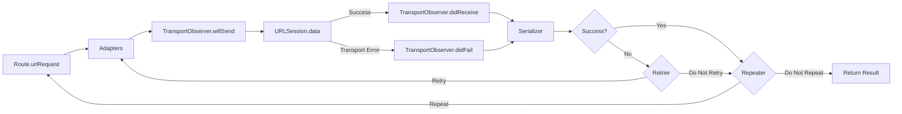
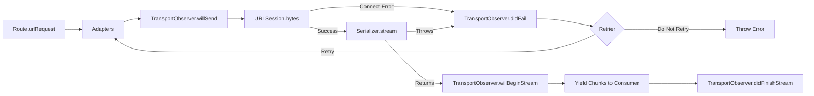

# PopNetworking [](https://github.com/djk12587/PopNetworking/actions/workflows/Run-Tests.yml)

PopNetworking is a protocol-oriented Swift networking layer where every HTTP endpoint is a self-documenting value type that carries its URL, body, serialization, hooks, and retry policy in one place. Two route surfaces are built in: **response routes** collect the full response and parse it into one typed value, and **stream routes** deliver typed chunks incrementally via `for try await` as bytes arrive (SSE, NDJSON, file downloads, LLM token streams). Built as a thin layer over `URLSession` with the safety of Swift 6 strict concurrency.

## Table of Contents

- [Requirements](#requirements)
- [Installation](#installation)
- [Documentation](#documentation)
- [Architecture](#architecture)
  - [Route Types](#route-types)
  - [Request Lifecycle](#request-lifecycle)
- [Quick Start](#quick-start)
  - [Response Routes](#response-routes)
  - [Stream Routes](#stream-routes)
- [Parameter Encoding](#parameter-encoding)
  - [URL-encoded](#url-encoded)
  - [JSON](#json)
  - [Multipart / Form Data](#multipart--form-data)
- [Response Routes](#response-routes-1)
  - [Response Serializers](#response-serializers)
  - [Repeater](#repeater)
- [Stream Routes](#stream-routes-1)
  - [Stream Serializers](#stream-serializers)
  - [Consuming with `task()`](#consuming-with-task)
  - [Cancellation](#cancellation)
- [NetworkingSession](#networkingsession)
- [Hooks](#hooks)
  - [Adapters](#adapters)
  - [Retriers](#retriers)
  - [Interceptors](#interceptors)
  - [Transport Observers](#transport-observers)
  - [Attaching Hooks](#attaching-hooks)
  - [Priority](#priority)
- [Testing](#testing)
- [License](#license)

## Requirements

- Swift 6.0+
- Xcode 16+
- iOS 13+ / tvOS 13+ / watchOS 6+ / macOS 10.15+ / visionOS 1.0+ / Mac Catalyst 13+

## Installation

Add PopNetworking to your project via Swift Package Manager:

```swift
dependencies: [
    .package(url: "https://github.com/djk12587/PopNetworking.git", from: "6.0.0")
]
```

## Documentation

- [Full API Reference](https://djk12587.github.io/PopNetworking/documentation/popnetworking)

## Architecture

A few aspects of this design are worth calling out:

- **Protocol-oriented end to end.** Every layer is a protocol: `NetworkingResponseRoute`, `NetworkingStreamRoute`, `NetworkingEndpoint`, `NetworkingHooks`, the serializers, adapter, retrier, interceptor, transport observer, session, and `URLSessionProtocol`. Any piece can be swapped or mocked without touching the rest. Default protocol extensions provide most of the implementation, so a minimal response route only declares its URL, method, and serializer, and gets every execution surface (`run`, `result`, `task`, `request`, `publisher`, `failablePublisher`) for free.
- **Two loops, not one.** The retrier handles failures *within* a single attempt (token refresh, transient errors). The repeater evaluates a response route's terminal result and decides whether to start a brand-new attempt (polling, conditional re-runs). They solve different problems and stay distinct concepts. Stream routes use the retrier for connect-time failures only and have no repeater. The consumer iterates `stream` again to restart from scratch.
- **Hooks compose across session and route.** Adapters, retriers, and interceptors can live on the session, the route, or both. They merge into a single execution chain ordered by `NetworkingPriority`, so app-wide concerns like auth layer cleanly under route-specific overrides. Transport observers attach the same way (as an array on either or both), but unlike adapters and retriers, they are side-effect-only. They do not influence the request and fire concurrently around each `URLSession` transport call.
- **Actors isolate per-request mutable state.** Retry counts, cached `URLRequest` values, and repeat counters live inside actors (`RouteTask`, `RepeaterState`). The retry and repeat loops are safe under Swift concurrency without locks or `@unchecked Sendable`.

### Route Types

PopNetworking ships two route surfaces, both sharing the same request-construction (`NetworkingEndpoint`) and hook (`NetworkingHooks`) model:

- **Response routes** (`NetworkingResponseRoute`). The response is collected and parsed into one typed value.
- **Stream routes** (`NetworkingStreamRoute`). The consumer iterates typed chunks as bytes arrive. Useful for Server-Sent Events, NDJSON feeds, large file downloads, and LLM token streams. Requires iOS 15+ / macOS 12+ / tvOS 15+ / watchOS 8+ / visionOS 1+.

### Request Lifecycle

**Response Route**



**Stream Route**



## Quick Start

### Response Routes

**Define** a struct that conforms to `NetworkingResponseRoute`. At minimum you declare `baseUrl`, `path`, `method`, and `serializer`. Group related endpoints inside an `enum` namespace to keep call sites readable.

```swift
enum UserAPI {
    struct GetUser: NetworkingResponseRoute {
        let userId: Int

        var baseUrl: String { "https://api.example.com" }
        var path: String { "users/\(userId)" }
        var method: NetworkingRouteHttpMethod { .get }
        var serializer: NetworkingSerializers.Response.Decodable<User> {
            .init()
        }
    }

    struct CreateUser: NetworkingResponseRoute {
        let name: String
        let email: String

        var baseUrl: String { "https://api.example.com" }
        var path: String { "users" }
        var method: NetworkingRouteHttpMethod { .post }
        var parameterEncoding: NetworkingRouteParameterEncoding? {
            .json(params: ["name": name, "email": email])
        }
        var serializer: NetworkingSerializers.Response.Decodable<User> {
            .init()
        }
    }
}
```

**Execute** via any of five surfaces:

```swift
// async/await
let user = try await UserAPI.GetUser(userId: 42).run

// Result
let result = await UserAPI.GetUser(userId: 42).result

// Completion handler
UserAPI.GetUser(userId: 42).request { result in
    switch result {
    case .success(let user): print(user)
    case .failure(let error): print(error)
    }
}

// Combine
UserAPI.GetUser(userId: 42).publisher
    .sink { result in print(result) }

UserAPI.GetUser(userId: 42).failablePublisher
    .sink(receiveCompletion: { _ in },
          receiveValue: { user in print(user) })
```

**One-off requests** use the concrete `ResponseRoute` struct so you do not need a dedicated type:

```swift
let data = try await ResponseRoute(
    baseUrl: "https://api.example.com",
    path: "health",
    serializer: NetworkingSerializers.Response.Data()
).run
```

### Stream Routes

*Stream routes require iOS 15+ / macOS 12+ / tvOS 15+ / watchOS 8+ / visionOS 1+.*

**Define** a struct that conforms to `NetworkingStreamRoute`. Choose a serializer that matches the stream format:

```swift
struct ChatStream: NetworkingStreamRoute {
    let prompt: String

    var baseUrl: String { "https://api.example.com" }
    var path: String { "chat" }
    var method: NetworkingRouteHttpMethod { .post }
    var parameterEncoding: NetworkingRouteParameterEncoding? {
        .json(params: ["prompt": prompt])
    }
    var serializer: NetworkingSerializers.Stream.SSE {
        .init()
    }
}
```

**Consume** via bare iteration or the `task()` helper:

```swift
let chatStream = ChatStream(prompt: "Hello")

// Bare iteration: break inside the loop to stop, or let the stream end naturally
for try await event in try await chatStream.stream {
    print(event.data)
}

// task() helper: returns a handle you can cancel or await for completion
let handle = chatStream.task { event in
    await store.append(event.data)
}

// Cancel from anywhere. Tears down the entire stream chain.
handle.cancel()

// Optional: await completion (throws on stream failure)
do { try await handle.value }
catch { print("stream failed: \(error)") }
```

Both patterns back-pressure the upstream. Awaiting inside the loop body or `onChunk` closure slows further pulls, and cancellation propagates through the whole chain to the underlying `URLSessionDataTask`.

**One-off streams** use the concrete `StreamRoute`:

```swift
for try await event in try await StreamRoute(
    baseUrl: "https://api.example.com",
    path: "chat",
    method: .post,
    parameterEncoding: .json(params: ["prompt": "hello"]),
    serializer: NetworkingSerializers.Stream.SSE()
).stream {
    print(event.data)
}
```

## Parameter Encoding

`NetworkingRouteParameterEncoding` describes how a route's parameters are added to its `URLRequest`. Set it on the route's `parameterEncoding` property. Three cases are built in: URL-encoded, JSON, and multipart.

### URL-encoded

`.url(params:encoder:)` percent-encodes a dictionary of parameters. By default the `URLEncoding.default` destination is `.methodDependent`, which sends `GET`, `HEAD`, `OPTIONS`, and `DELETE` parameters as a query string and all other methods as an `application/x-www-form-urlencoded` body. Pass `.queryString` or `.httpBody` to override.

```swift
struct SearchUsers: NetworkingResponseRoute {
    var parameterEncoding: NetworkingRouteParameterEncoding? {
        .url(params: ["q": "search term", "limit": 20])
    }
    // ...
}
```

### JSON

`.json(params:encoder:urlParams:urlEncoder:)` serializes a dictionary as JSON and sets `Content-Type: application/json`. The optional `urlParams` are appended to the URL as a query string, so you can mix a JSON body with query parameters in one call.

```swift
struct RegisterUser: NetworkingResponseRoute {
    var parameterEncoding: NetworkingRouteParameterEncoding? {
        .json(params: ["name": "Dan", "email": "dan@example.com"])
    }
    // ...
}
```

If you already have JSON-encoded `Data` (for example, from a `JSONEncoder`), use `.jsonData(data:...)` instead.

### Multipart / Form Data

`.multipart(parts:encoder:urlParams:urlEncoder:)` builds a `multipart/form-data` body for image uploads, form submissions with file attachments, and similar use cases. Build an array of `MultipartPart`:

```swift
struct UploadAvatar: NetworkingResponseRoute {
    let imageData: Data

    var parameterEncoding: NetworkingRouteParameterEncoding? {
        .multipart(parts: [
            .text(name: "caption", value: "hello"),
            .data(name: "avatar",
                  data: imageData,
                  filename: "avatar.png",
                  mimeType: "image/png")
        ])
    }
    // ...
}
```

`MultipartPart` has three cases:

| Case | Use Case |
|---|---|
| `.text(name:, value:)` | Plain text field |
| `.data(name:, data:, filename:, mimeType:)` | Binary part with explicit filename and MIME type |
| `.file(name:, fileURL:, filename:, mimeType:)` | Read a file from disk at encode time |

For `.file`, `filename` defaults to `fileURL.lastPathComponent` and `mimeType` is auto-detected from the file extension (iOS 14+ / macOS 11+), falling back to `application/octet-stream`.

The `Content-Type: multipart/form-data; boundary=…` header is set automatically with an auto-generated boundary, and non-ASCII filenames emit both an ASCII-safe `filename="..."` fallback and an RFC 5987 `filename*=UTF-8''...` parameter for cross-server compatibility.

> **Note:** File parts are read into memory at encode time. For very large uploads where streaming from disk matters, construct your own `URLSession.uploadTask(with:fromFile:)`.

## Response Routes

The `NetworkingResponseRoute` protocol covers the standard request/response pattern. The full lifecycle is shown in the [response route diagram](#request-lifecycle) above. The sections below cover the response-specific building blocks: serializers and the repeater.

### Response Serializers

Serializers parse raw response data into typed objects. PopNetworking includes five built-in serializers in the `NetworkingSerializers.Response` namespace:

| Serializer | SerializedObject | Use for |
|---|---|---|
| `NetworkingSerializers.Response.Decodable<T>` | `T` | Standard JSON decoding |
| `NetworkingSerializers.Response.DecodableAndError<T, E>` | `T` or throws `E` | JSON with typed API errors |
| `NetworkingSerializers.Response.Data` | `Data` | Raw response body |
| `NetworkingSerializers.Response.HttpStatusCode` | `Int` | Returns the status code, discards the body |
| `NetworkingSerializers.Response.Empty` | `Void` | `HEAD` / `204 No Content` / endpoints with no body |

To write a custom serializer, conform to `NetworkingResponseSerializer`:

```swift
struct StringResponseSerializer: NetworkingResponseSerializer {
    func serialize(responseResult: Result<(Data, URLResponse), Error>) async -> Result<String, Error> {
        responseResult.flatMap { data, _ in
            guard let string = String(data: data, encoding: .utf8) else {
                return .failure(URLError(.cannotDecodeContentData))
            }
            return .success(string)
        }
    }
}
```

Custom stream serializers conform to `NetworkingStreamSerializer` and live in the [Stream Routes](#stream-routes-1) chapter.

### Repeater

The repeater is a response-only feature. Stream routes have no repeater concept. The consumer iterates `stream` again to re-run the request from scratch.

A repeater restarts the entire [response route lifecycle](#request-lifecycle) (including `urlRequest` building and adapters) based on the serialized result. Unlike a [retrier](#retriers), which handles failures within a single attempt, a repeater evaluates the terminal result and decides whether to start a fresh attempt. Useful for polling:

```swift
struct PollStatus: NetworkingResponseRoute {
    var repeater: Repeater? {
        { result, urlRequest, response, repeatCount in
            if case .success(let status) = result, status.state == .pending, repeatCount < 10 {
                return .retryWithDelay(2.0)
            }
            return .doNotRetry
        }
    }
    // ...
}
```

## Stream Routes

*Stream routes require iOS 15+ / macOS 12+ / tvOS 15+ / watchOS 8+ / visionOS 1+.*

The `NetworkingStreamRoute` protocol covers incremental streaming responses. The full lifecycle is shown in the [stream route diagram](#request-lifecycle) above. The sections below cover the stream-specific building blocks: serializers, the `task()` helper, and cancellation.

### Stream Serializers

Stream serializers parse an incoming byte stream into typed chunks. PopNetworking includes four built-in serializers in the `NetworkingSerializers.Stream` namespace:

| Serializer | Chunk type | Use for |
|---|---|---|
| `NetworkingSerializers.Stream.Data` | `Foundation.Data` | Raw byte forwarding (file downloads, custom binary protocols) |
| `NetworkingSerializers.Stream.Line` | `String` | Line-delimited UTF-8 (text streams, simple log feeds) |
| `NetworkingSerializers.Stream.Decodable<T>` | `T` | NDJSON / line-delimited JSON, one `Decodable` per line |
| `NetworkingSerializers.Stream.SSE` | `SSEEvent` | Server-Sent Events (LLM streaming, real-time feeds) |

Custom stream serializers conform to `NetworkingStreamSerializer`. The serializer receives the live `AsyncThrowingStream<Data, Error>` and the initial `URLResponse`. Throw to reject the response before any chunk reaches the consumer (triggers the connect-time retrier), or return a typed chunk stream the consumer iterates.

### Consuming with `task()`

`NetworkingStreamRoute.task(priority:onChunk:)` wraps a `for try await` loop in a `Task<Void, Error>`. The closure runs once per chunk in arrival order. Awaiting inside the closure back-pressures the upstream.

```swift
let handle = chatRoute.task { event in
    process(event)
}

// Cancel from anywhere. Tears down the entire stream chain.
handle.cancel()

// Optional: await completion (throws on stream failure)
do { try await handle.value }
catch { print("stream failed: \(error)") }
```

### Cancellation

Three ways a stream stops:

1. `break` inside the for-loop (in-loop signal).
2. `handle.cancel()` (external signal, when using the `task()` helper).
3. Mid-stream upstream error (automatically surfaces as a throw from the for-await).

All three tear down the underlying `URLSessionDataTask`. The `handle.cancel()` pattern is the canonical choice when the consumer needs to stop the stream from outside the iteration loop, for example in response to a user action or a deadline.

## NetworkingSession

`NetworkingSession` wraps `URLSession` and orchestrates the [request lifecycle](#request-lifecycle). Every route uses `NetworkingSession.shared` by default, or you can create custom sessions:

```swift
let ephemeralSession = NetworkingSession(
    urlSession: URLSession(configuration: .ephemeral),
    adapter: authAdapter,
    retrier: authRetrier
)

struct GetUser: NetworkingResponseRoute {
    var session: NetworkingSessionProtocol { ephemeralSession }
    // ...
}
```

## Hooks

Hooks let you extend the request lifecycle at specific points. Adapters, retriers, and interceptors can modify the request or influence retry behavior. Transport observers are side-effect-only: they watch the lifecycle without changing it. All hooks compose across session and route.

### Adapters

Adapters modify a `URLRequest` before it is sent. Common use case: adding auth headers.

```swift
struct AuthAdapter: NetworkingAdapter {
    let token: String

    func adapt(urlRequest: URLRequest) async throws -> URLRequest {
        var request = urlRequest
        request.setValue("Bearer \(token)", forHTTPHeaderField: "Authorization")
        return request
    }
}
```

See [Attaching Hooks](#attaching-hooks) for how to wire one in.

### Retriers

Retriers decide whether to retry a failed request *within* a single attempt. To restart the whole request lifecycle from a successful or failed terminal result (for example, polling), use a [Repeater](#repeater) instead. They receive the error, the response, and the current retry count:

```swift
struct RetryOn401: NetworkingRetrier {
    func retry(urlRequest: URLRequest?,
               dueTo error: Error,
               urlResponse: URLResponse?,
               retryCount: Int) async -> NetworkingRetrierResult {
        guard retryCount < 3,
              let http = urlResponse as? HTTPURLResponse,
              http.statusCode == 401 else {
            return .doNotRetry
        }
        return .retry
        // or: .retryWithDelay(1.0)
    }
}
```

See [Attaching Hooks](#attaching-hooks) for how to wire one in.

### Interceptors

An interceptor combines an adapter and a retrier into a single object. This is useful for auth token refresh flows where the same object needs to both attach a token (adapt) and refresh it on 401 (retry):

```swift
struct AuthInterceptor: NetworkingInterceptor {
    let tokenStore: TokenStore

    func adapt(urlRequest: URLRequest) async throws -> URLRequest {
        var request = urlRequest
        let token = await tokenStore.currentToken
        request.setValue("Bearer \(token)", forHTTPHeaderField: "Authorization")
        return request
    }

    func retry(urlRequest: URLRequest?,
               dueTo error: Error,
               urlResponse: URLResponse?,
               retryCount: Int) async -> NetworkingRetrierResult {
        guard retryCount < 1,
              let http = urlResponse as? HTTPURLResponse,
              http.statusCode == 401 else {
            return .doNotRetry
        }
        await tokenStore.refreshToken()
        return .retry
    }
}

let session = NetworkingSession(interceptor: AuthInterceptor(tokenStore: store))
```

Each route or session accepts only one adapter, one retrier, and one interceptor. To attach multiple of any kind, bundle them with `RouteInterceptor`:

```swift
let interceptor = RouteInterceptor(
    adapters: [authAdapter, loggingAdapter],
    retriers: [authRetrier, networkRetrier]
)
```

### Transport Observers

Transport observers watch a route's `URLSession` transport call without changing its behavior. They fire around the underlying HTTP exchange. They do not fire around adapters, serializers, retriers, or repeaters. Use them for logging, analytics, or breadcrumbs:

```swift
struct LoggingObserver: NetworkingTransportObserver {
    func willSend(urlRequest: URLRequest) async {
        print("REQUEST: \(urlRequest.httpMethod ?? "GET") \(urlRequest.url?.absoluteString ?? "")")
    }

    func didReceive(data: Data, urlResponse: URLResponse) async {
        let status = (urlResponse as? HTTPURLResponse)?.statusCode ?? 0
        print("RESPONSE: \(status) (\(data.count) bytes)")
    }

    func didFail(urlRequest: URLRequest, dueTo error: Error) async {
        print("FAILED: \(urlRequest.url?.absoluteString ?? ""): \(error)")
    }

    // Stream-only hooks. Default no-ops, implement only if you need them.
    func willBeginStream(urlRequest: URLRequest, urlResponse: URLResponse) async {
        print("STREAM STARTED: \(urlRequest.url?.absoluteString ?? "")")
    }

    func didFinishStream(urlRequest: URLRequest, urlResponse: URLResponse, error: Error?) async {
        if let error {
            print("STREAM FAILED: \(urlRequest.url?.absoluteString ?? ""): \(error)")
        } else {
            print("STREAM FINISHED: \(urlRequest.url?.absoluteString ?? "")")
        }
    }
}
```

Behavior:

- Transport observers fire **per attempt**, so every retry produces its own `willSend` / `didReceive` / `didFail` cycle.
- `didFail` fires for transport-level errors (`URLSession.data(for:)` or `URLSession.bytes(for:)` threw) and for serializer `stream(...)` throws at connect time. Serializer rejections on response routes do not trigger `didFail` since `didReceive` already fired with the raw bytes.
- `willBeginStream` fires when a stream route's connection succeeds and chunks are about to flow. Stream-only, default no-op.
- `didFinishStream` fires exactly once when a stream route terminates. `nil` error on clean EOF, non-`nil` on transport failure or consumer cancellation (`URLError(.cancelled)`). Stream-only, default no-op.
- Session-level and route-level transport observers all fire **concurrently** for each transport event with no ordering guarantee between them.
- Callbacks run **inline** on the request path. A slow transport observer slows every request.

For expensive work (file I/O, third-party SDKs) where you do not need the temporal guarantees, spawn a `Task` inside the callback so the trade-off is visible at the call site:

```swift
func willSend(urlRequest: URLRequest) async {
    Task.detached { await self.expensiveLog(urlRequest) }
}
```

Attach transport observers on a route, a session, or both:

```swift
// Route-level
struct GetUser: NetworkingResponseRoute {
    var observers: [NetworkingTransportObserver] { [LoggingObserver()] }
    // ...
}

// Session-level
let session = NetworkingSession(observers: [LoggingObserver()])
```

### Attaching Hooks

Adapters, retriers, and interceptors attach as a single property on a route or as an init parameter on a session, or both. Transport observers attach as an array, so you can pass as many as you want at each level.

```swift
// Route-level. Hooks declared on a custom struct.
struct GetUser: NetworkingResponseRoute {
    var adapter: NetworkingAdapter? { LoggingAdapter() }
    var observers: [NetworkingTransportObserver] { [LoggingObserver()] }
    // ...
}

// One-off. Hooks passed inline.
let route = ResponseRoute(
    baseUrl: "https://api.example.com",
    path: "users/42",
    serializer: NetworkingSerializers.Response.Decodable<User>(),
    adapter: LoggingAdapter(),
    observers: [LoggingObserver()]
)

// Session-level. Hooks apply to every route on this session.
let session = NetworkingSession(
    adapter: AuthAdapter(token: "..."),
    observers: [LoggingObserver()]
)
```

Every hook runs for the route. Session-level hooks always fire, and route-level hooks fire alongside them. Stream routes attach hooks the same way since they share the `NetworkingHooks` protocol.

### Priority

Adapters, retriers, and interceptors have a `priority` that controls execution order. Higher priority runs first:

```swift
struct HighPriorityAdapter: NetworkingAdapter {
    var priority: NetworkingPriority { .high }
    // ...
}
```

Built-in levels: `.highest`, `.high`, `.standard` (default), `.low`, `.lowest`. You can also use `NetworkingPriority(_:)` for custom values.

Transport observers do not participate in priority sorting. Session-level and route-level transport observers all fire concurrently with no ordering guarantee between them.

## Testing

PopNetworking supports testing at two levels. Use the first for unit tests of code that consumes a route, and use the second for integration tests of the full request/response pipeline.

**Mock the serialized result** to skip the network call while still exercising your route's adapters, retriers, interceptors, and repeater:

```swift
struct GetUser: NetworkingResponseRoute {
    var mockSerializedResult: Result<User, Error>? {
        .success(User(id: 1, name: "Test"))
    }
    // ...
}

let user = try await GetUser().run // no network call
```

When `mockSerializedResult` is set, `URLSession.data(for:)`, the response serializer, and transport observer notifications are all skipped. Use this for unit tests that focus on the route's request-side behavior.

**Mock URLSession** by conforming to `URLSessionProtocol` to exercise the full [request lifecycle](#request-lifecycle) against fake transport data. Leave `mockSerializedResult` unset, since that property short-circuits before `URLSession.data(for:)` is called:

```swift
struct MockURLSession: URLSessionProtocol {
    let session = URLSession(configuration: .default)

    func data(for request: URLRequest) async throws -> (Data, URLResponse) {
        let json = #"{"id": 1, "name": "Test"}"#.data(using: .utf8)!
        let response = HTTPURLResponse(url: request.url!, statusCode: 200, httpVersion: nil, headerFields: nil)!
        return (json, response)
    }
}

let session = NetworkingSession(urlSession: MockURLSession())
```

**Mock streaming** by setting `mockChunks` on a route to short-circuit the network and feed the serializer synthesized byte chunks:

```swift
struct MockChatStream: NetworkingStreamRoute {
    var serializer: NetworkingSerializers.Stream.SSE { .init() }
    var mockChunks: [Result<Data, Error>] {
        [.success("data: hello\n\n".data(using: .utf8)!)]
    }
    // ...
}
```

When `mockChunks` is non-empty, `URLSession.bytes(for:)` and transport observer notifications are skipped. The serializer receives the synthesized byte stream, so parsing and chunk delivery still run. Adapters, retriers, and interceptors still execute.

## License

PopNetworking is available under the MIT license. See [LICENSE](LICENSE) for details.
