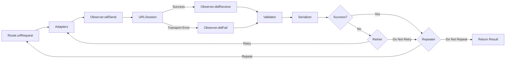

# PopNetworking [](https://github.com/djk12587/PopNetworking/actions/workflows/Run-Tests.yml)

PopNetworking is a protocol-oriented Swift networking layer where every HTTP endpoint (route) is a self-documenting value type that carries its URL, body, validation, serialization, and retry policy in one place. Run any route via async/await, Combine, callbacks, or Result. Built as a thin layer over URLSession with the safety of Swift 6 strict concurrency.

## Table of Contents

- [Requirements](#requirements)
- [Installation](#installation)
- [Documentation](#documentation)
- [Architecture](#architecture)
- [Quick Start](#quick-start)
- [Core Concepts](#core-concepts)
  - [Parameter Encoding](#parameter-encoding)
  - [Response Validation](#response-validation)
  - [Response Serializers](#response-serializers)
  - [NetworkingSession](#networkingsession)
  - [Hooks](#hooks)
    - [Adapters](#adapters)
    - [Retriers](#retriers)
    - [Interceptors](#interceptors)
    - [Observers](#observers)
    - [Attaching Hooks](#attaching-hooks)
    - [Priority](#priority)
  - [Repeater](#repeater)
  - [Testing](#testing)
- [License](#license)

## Requirements

- Swift 6.0+
- Xcode 16+
- iOS 13+ / tvOS 13+ / watchOS 6+ / macOS 10.15+ / visionOS 1.0+ / Mac Catalyst 13+

## Installation

Add PopNetworking to your project via Swift Package Manager:

```swift
dependencies: [
    .package(url: "https://github.com/djk12587/PopNetworking.git", from: "4.0.0")
]
```

## Documentation

- [Full API Reference](https://djk12587.github.io/PopNetworking/documentation/popnetworking)

## Architecture

A few aspects of this design are worth calling out:

- **Protocol-oriented end to end.** Every layer is a protocol: `NetworkingRoute`, the serializer, validator, adapter, retrier, interceptor, observers, session, and `URLSessionProtocol`. Any piece can be swapped or mocked without touching the rest. Default protocol extensions provide most of the implementation, so a minimal route only declares its URL, method, and serializer, and gets every execution surface (`run`, `result`, `task`, `request`, `publisher`, `failablePublisher`) for free.
- **Two loops, not one.** The retrier handles failures *within* a single attempt (token refresh, transient errors). The repeater evaluates an attempt's terminal result and decides whether to start a brand-new one (polling, conditional re-runs). They solve different problems and stay distinct concepts.
- **Hooks compose across session and route.** Adapters, retriers, and interceptors can live on the session, the route, or both. They merge into a single execution chain ordered by `NetworkingPriority`, so app-wide concerns like auth layer cleanly under route-specific overrides. Observers attach the same way (as an array on either or both) but are side-effect-only — they don't influence the request and fire concurrently for each lifecycle event.

### Request Lifecycle



## Quick Start

### Define a Route

```swift
enum UserAPI {
    struct GetUser: NetworkingRoute {
        let userId: Int

        var baseUrl: String { "https://api.example.com" }
        var path: String { "users/\(userId)" }
        var method: NetworkingRouteHttpMethod { .get }
        var responseSerializer: NetworkingResponseSerializers.DecodableResponseSerializer<User> {
            .init()
        }
    }

    struct CreateUser: NetworkingRoute {
        let name: String
        let email: String

        var baseUrl: String { "https://api.example.com" }
        var path: String { "users" }
        var method: NetworkingRouteHttpMethod { .post }
        var parameterEncoding: NetworkingRouteParameterEncoding? {
            .json(params: ["name": name, "email": email])
        }
        var responseSerializer: NetworkingResponseSerializers.DecodableResponseSerializer<User> {
            .init()
        }
    }
}
```

### Execute

```swift
// async/await
let user = try await UserAPI.GetUser(userId: 42).run

// Result
let result = await UserAPI.GetUser(userId: 42).result

// Completion handler
UserAPI.GetUser(userId: 42).request { result in
    switch result {
    case .success(let user): print(user)
    case .failure(let error): print(error)
    }
}

// Combine
UserAPI.GetUser(userId: 42).publisher
    .sink { result in print(result) }

UserAPI.GetUser(userId: 42).failablePublisher
    .sink(receiveCompletion: { _ in },
          receiveValue: { user in print(user) })
```

### One-off Route

For one-off requests, use the built-in `Route` struct:

```swift
let data = try await Route(
    baseUrl: "https://api.example.com",
    path: "health",
    responseSerializer: NetworkingResponseSerializers.DataResponseSerializer()
).run
```

## Core Concepts

### Parameter Encoding

`NetworkingRouteParameterEncoding` describes how a route's parameters are added to its `URLRequest`. Set it on the route's `parameterEncoding` property. Three cases are built in: URL-encoded, JSON, and multipart.

#### URL-encoded

`.url(params:encoder:)` percent-encodes a dictionary of parameters. By default the `URLEncoding.default` destination is `.methodDependent` — `GET`/`HEAD`/`DELETE` get a query string, anything else gets an `application/x-www-form-urlencoded` body. Pass `.queryString` or `.httpBody` to override.

```swift
struct SearchUsers: NetworkingRoute {
    var parameterEncoding: NetworkingRouteParameterEncoding? {
        .url(params: ["q": "search term", "limit": 20])
    }
    // ...
}
```

#### JSON

`.json(params:encoder:urlParams:urlEncoder:)` serializes a dictionary as JSON and sets `Content-Type: application/json`. The optional `urlParams` are appended to the URL as a query string, so you can mix a JSON body with query parameters in one call.

```swift
struct RegisterUser: NetworkingRoute {
    var parameterEncoding: NetworkingRouteParameterEncoding? {
        .json(params: ["name": "Dan", "email": "dan@example.com"])
    }
    // ...
}
```

If you already have JSON-encoded `Data` (e.g., from a `JSONEncoder`), use `.jsonData(data:...)` instead.

#### Multipart / Form Data

`.multipart(parts:encoder:urlParams:urlEncoder:)` builds a `multipart/form-data` body — useful for image uploads, form submissions with file attachments, etc. Build an array of `MultipartPart`:

```swift
struct UploadAvatar: NetworkingRoute {
    let imageData: Data

    var parameterEncoding: NetworkingRouteParameterEncoding? {
        .multipart(parts: [
            .text(name: "caption", value: "hello"),
            .data(name: "avatar",
                  data: imageData,
                  filename: "avatar.png",
                  mimeType: "image/png")
        ])
    }
    // ...
}
```

`MultipartPart` has three cases:

| Case | Use Case |
|---|---|
| `.text(name:, value:)` | Plain text field |
| `.data(name:, data:, filename:, mimeType:)` | Binary part with explicit filename and MIME type |
| `.file(name:, fileURL:, filename:, mimeType:)` | Read a file from disk at encode time |

For `.file`, `filename` defaults to `fileURL.lastPathComponent` and `mimeType` is auto-detected from the file extension (iOS 14+ / macOS 11+), falling back to `application/octet-stream`.

The `Content-Type: multipart/form-data; boundary=…` header is set automatically with an auto-generated boundary, and non-ASCII filenames emit both an ASCII-safe `filename="..."` fallback and an RFC 5987 `filename*=UTF-8''...` parameter for cross-server compatibility.

> **Note:** File parts are read into memory at encode time. For very large uploads where streaming from disk matters, construct your own `URLSession.uploadTask(with:fromFile:)`.

### Response Validation

Validate raw responses before serialization. Throw to indicate failure:

```swift
struct StatusCodeValidator: NetworkingResponseValidator {
    func validate(responseResult: Result<(Data, URLResponse), Error>) throws {
        let (_, response) = try responseResult.get()
        guard let http = response as? HTTPURLResponse,
              (200..<300).contains(http.statusCode) else {
            throw URLError(.badServerResponse)
        }
    }
}

struct GetUser: NetworkingRoute {
    // ...
    var responseValidator: NetworkingResponseValidator? { StatusCodeValidator() }
}
```

### Response Serializers

Serializers parse raw response data into typed objects. PopNetworking includes four built-in serializers:

| Serializer | Output | Use Case |
|---|---|---|
| `DecodableResponseSerializer<T>` | `T: Decodable` | Parse JSON into a model |
| `DecodableResponseAndErrorSerializer<T, E>` | `T: Decodable` | Parse JSON into a model or a typed API error |
| `DataResponseSerializer` | `Data` | Raw response data |
| `HttpStatusCodeResponseSerializer` | `Int` | HTTP status code only |

To write a custom serializer, conform to `NetworkingResponseSerializer`:

```swift
struct StringResponseSerializer: NetworkingResponseSerializer {
    func serialize(responseResult: Result<(Data, URLResponse), Error>) async -> Result<String, Error> {
        responseResult.flatMap { data, _ in
            guard let string = String(data: data, encoding: .utf8) else {
                return .failure(URLError(.cannotDecodeContentData))
            }
            return .success(string)
        }
    }
}
```

### NetworkingSession

`NetworkingSession` wraps `URLSession` and orchestrates the [request lifecycle](#request-lifecycle). Every route uses `NetworkingSession.shared` by default, or you can create custom sessions:

```swift
let ephemeralSession = NetworkingSession(
    urlSession: URLSession(configuration: .ephemeral),
    adapter: authAdapter,
    retrier: authRetrier
)

struct GetUser: NetworkingRoute {
    var session: NetworkingSessionProtocol { ephemeralSession }
    // ...
}
```

### Hooks

Hooks let you observe and modify the request lifecycle at specific points. They compose across session and route.

#### Adapters

Adapters modify a `URLRequest` before it is sent. Common use case: adding auth headers.

```swift
struct AuthAdapter: NetworkingAdapter {
    let token: String

    func adapt(urlRequest: URLRequest) async throws -> URLRequest {
        var request = urlRequest
        request.setValue("Bearer \(token)", forHTTPHeaderField: "Authorization")
        return request
    }
}
```

See [Attaching Hooks](#attaching-hooks) for how to wire one in.

#### Retriers

Retriers decide whether to retry a failed request. They receive the error, the response, and the current retry count:

```swift
struct RetryOn401: NetworkingRetrier {
    func retry(urlRequest: URLRequest?,
               dueTo error: Error,
               urlResponse: URLResponse?,
               retryCount: Int) async -> NetworkingRetrierResult {
        guard retryCount < 3,
              let http = urlResponse as? HTTPURLResponse,
              http.statusCode == 401 else {
            return .doNotRetry
        }
        return .retry
        // or: .retryWithDelay(1.0)
    }
}
```

See [Attaching Hooks](#attaching-hooks) for how to wire one in.

#### Interceptors

An interceptor combines an adapter and a retrier into a single object. This is useful for auth token refresh flows where the same object needs to both attach a token (adapt) and refresh it on 401 (retry):

```swift
struct AuthInterceptor: NetworkingInterceptor {
    let tokenStore: TokenStore

    func adapt(urlRequest: URLRequest) async throws -> URLRequest {
        var request = urlRequest
        let token = await tokenStore.currentToken
        request.setValue("Bearer \(token)", forHTTPHeaderField: "Authorization")
        return request
    }

    func retry(urlRequest: URLRequest?,
               dueTo error: Error,
               urlResponse: URLResponse?,
               retryCount: Int) async -> NetworkingRetrierResult {
        guard retryCount < 1,
              let http = urlResponse as? HTTPURLResponse,
              http.statusCode == 401 else {
            return .doNotRetry
        }
        await tokenStore.refreshToken()
        return .retry
    }
}

let session = NetworkingSession(interceptor: AuthInterceptor(tokenStore: store))
```

Each route or session accepts only one adapter, one retrier, and one interceptor. To attach multiple of any kind, bundle them with `RouteInterceptor`:

```swift
let interceptor = RouteInterceptor(
    adapters: [authAdapter, loggingAdapter],
    retriers: [authRetrier, networkRetrier]
)
```

#### Observers

Observers watch a route's lifecycle without changing its behavior. Use them for logging, analytics, or breadcrumbs:

```swift
struct LoggingObserver: NetworkingTransportObserver {
    func willSend(urlRequest: URLRequest) async {
        print("REQUEST: \(urlRequest.httpMethod ?? "GET") \(urlRequest.url?.absoluteString ?? "")")
    }

    func didReceive(data: Data, urlResponse: URLResponse) async {
        let status = (urlResponse as? HTTPURLResponse)?.statusCode ?? 0
        print("RESPONSE: \(status) (\(data.count) bytes)")
    }

    func didFail(urlRequest: URLRequest, dueTo error: Error) async {
        print("FAILED: \(urlRequest.url?.absoluteString ?? ""): \(error)")
    }
}
```

Behavior:

- Observers fire **per attempt** — every retry produces its own `willSend` / `didReceive` / `didFail` cycle.
- `didFail` only fires for transport-level errors (`URLSession.data(for:)` threw). Validator and serializer rejections don't trigger `didFail`; `didReceive` already fired with the raw bytes in those cases.
- All observers — session-level and route-level — fire **concurrently** for each lifecycle event with no ordering guarantee between them.
- Callbacks run **inline** on the request path. `willSend` runs before `URLSession.data(for:)`; `didReceive`/`didFail` run before the next attempt begins. A slow observer slows every request.

For expensive work (file I/O, third-party SDKs) where you don't need the temporal guarantees, spawn a `Task` inside the callback so the trade-off is visible at the call site:

```swift
func willSend(urlRequest: URLRequest) async {
    Task.detached { await self.expensiveLog(urlRequest) }
}
```

Attach observers on a route, a session, or both:

```swift
// Route-level
struct GetUser: NetworkingRoute {
    var observers: [NetworkingTransportObserver] { [LoggingObserver()] }
    // ...
}

// Session-level
let session = NetworkingSession(observers: [LoggingObserver()])
```

See [Attaching Hooks](#attaching-hooks) for how observers compose with other hooks.

#### Attaching Hooks

Adapters, retriers, and interceptors attach as a single property on a route or as an init parameter on a session, or both. Observers attach as an array — pass as many as you want at each level.

```swift
// Route-level (extra logging on just this endpoint while debugging)
struct GetUser: NetworkingRoute {
    var adapter: NetworkingAdapter? { LoggingAdapter() }
    var observers: [NetworkingTransportObserver] { [LoggingObserver()] }
    // ...
}

// Session-level (auth and global telemetry apply to every route on this session)
let session = NetworkingSession(
    adapter: AuthAdapter(token: "..."),
    observers: [LoggingObserver()]
)
```

Every hook runs for `GetUser`: the session-level adapter adds the auth header, the session-level observers fire, and the route-level adapter and observer fire too.

#### Priority

Adapters, retriers, and interceptors have a `priority` that controls execution order. Higher priority runs first:

```swift
struct HighPriorityAdapter: NetworkingAdapter {
    var priority: NetworkingPriority { .high }
    // ...
}
```

Built-in levels: `.highest`, `.high`, `.standard` (default), `.low`, `.lowest`. You can also use `NetworkingPriority(_:)` for custom values.

Observers don't participate in priority sorting. All observers — session-level and route-level — fire concurrently with no ordering guarantee between them.

### Repeater

A repeater restarts the entire [request lifecycle](#request-lifecycle) (including adapters) based on the serialized result. Unlike a retrier, which handles failures within a single attempt, a repeater evaluates the final result and decides whether to start a fresh attempt. Useful for polling:

```swift
struct PollStatus: NetworkingRoute {
    var repeater: Repeater? {
        { result, urlRequest, response, repeatCount in
            if case .success(let status) = result, status.state == .pending, repeatCount < 10 {
                return .retryWithDelay(2.0)
            }
            return .doNotRetry
        }
    }
    // ...
}
```

### Testing

PopNetworking supports testing at two levels. Use the first for unit tests of code that consumes a route; use the second for integration tests of the full request/response pipeline.

**Mock the serialized result** to skip the network entirely:

```swift
struct GetUser: NetworkingRoute {
    var mockSerializedResult: Result<User, Error>? {
        .success(User(id: 1, name: "Test"))
    }
    // ...
}

let user = try await GetUser().run // no network call
```

**Mock URLSession** by conforming to `URLSessionProtocol`:

```swift
struct MockURLSession: URLSessionProtocol {
    let session = URLSession(configuration: .default)

    func data(for request: URLRequest) async throws -> (Data, URLResponse) {
        let json = #"{"id": 1, "name": "Test"}"#.data(using: .utf8)!
        let response = HTTPURLResponse(url: request.url!, statusCode: 200, httpVersion: nil, headerFields: nil)!
        return (json, response)
    }
}

let session = NetworkingSession(urlSession: MockURLSession())
```

## License

PopNetworking is available under the MIT license. See [LICENSE](LICENSE) for details.
